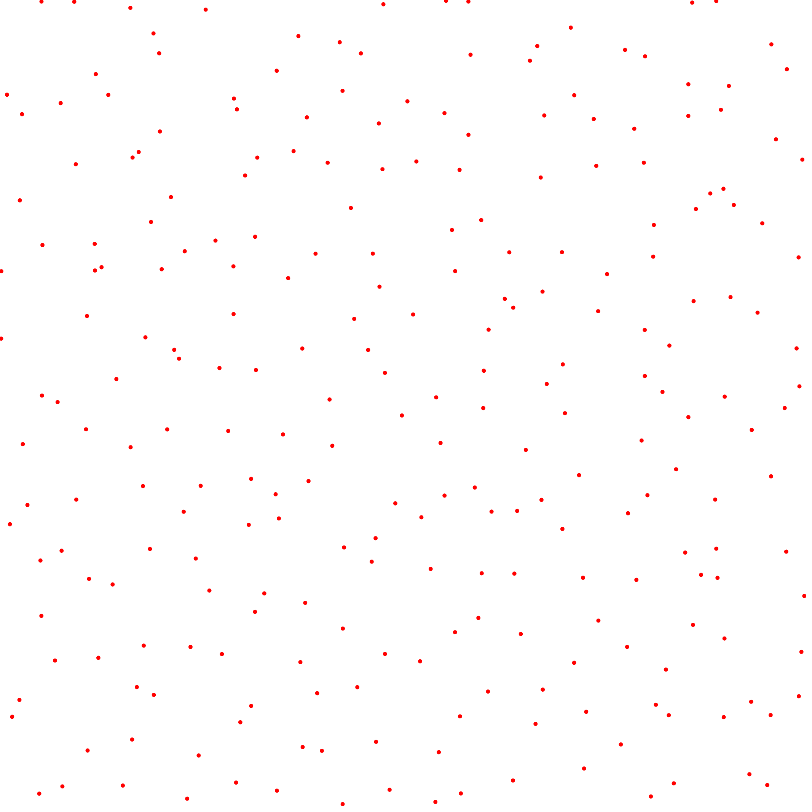
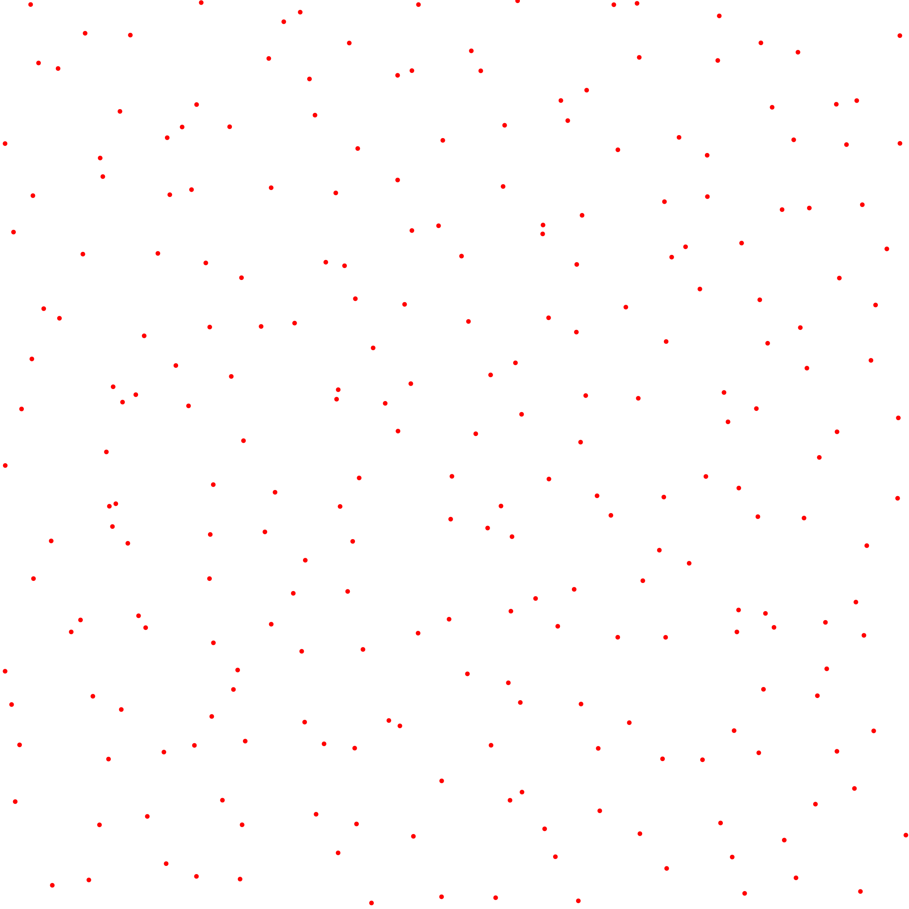
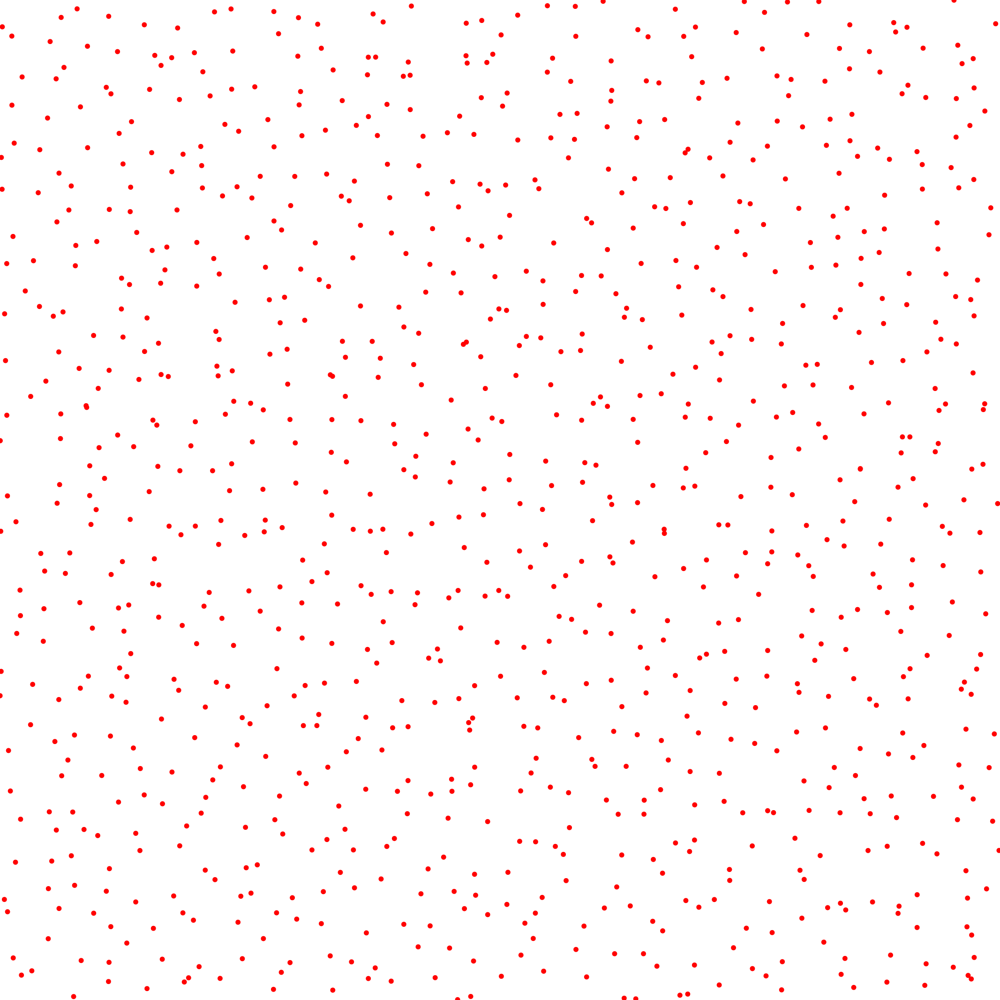
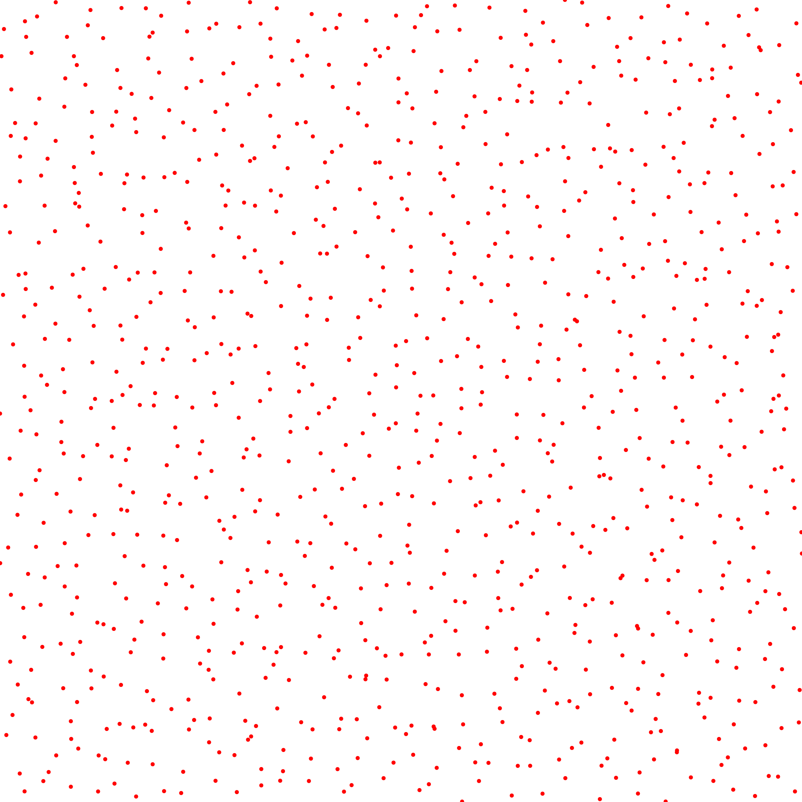
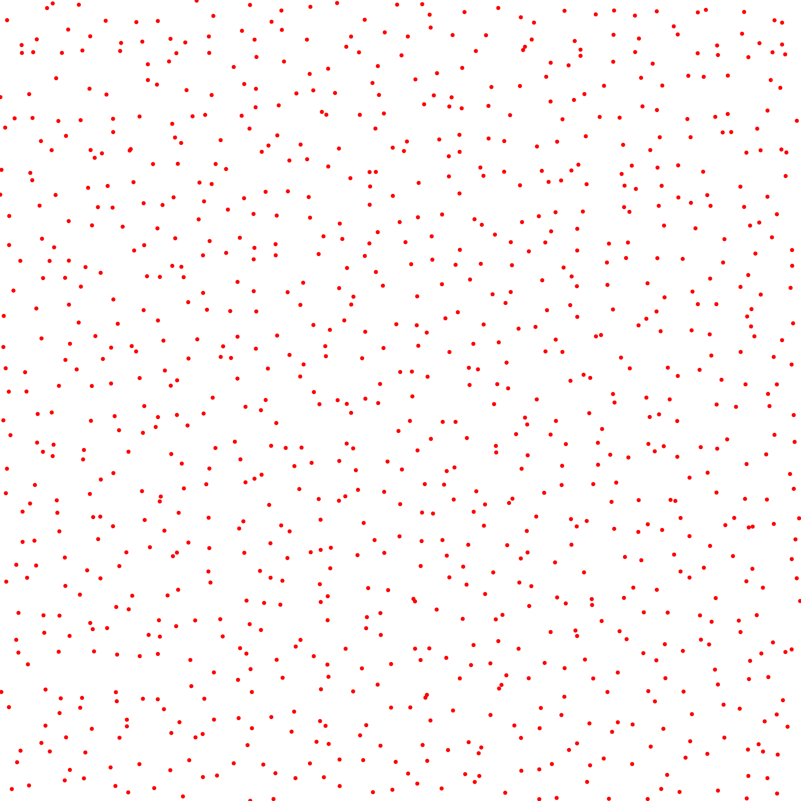
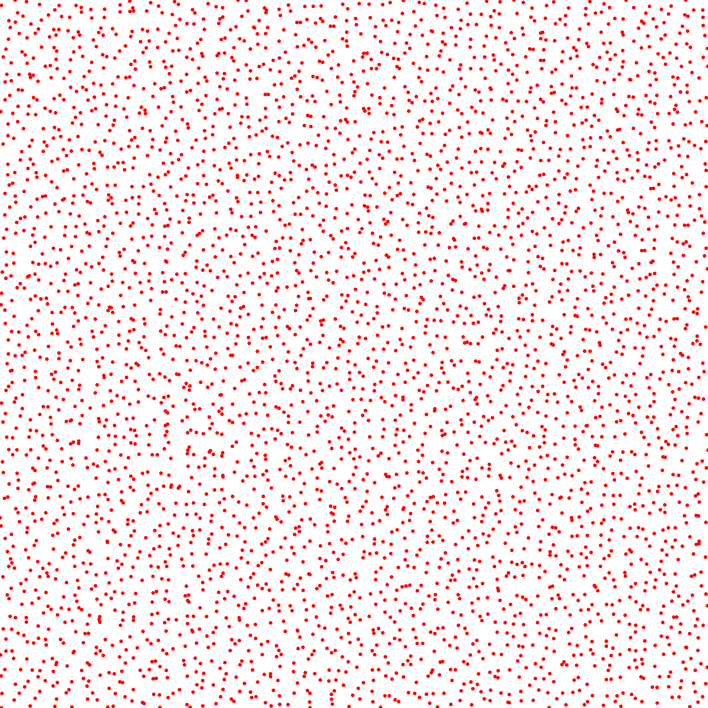
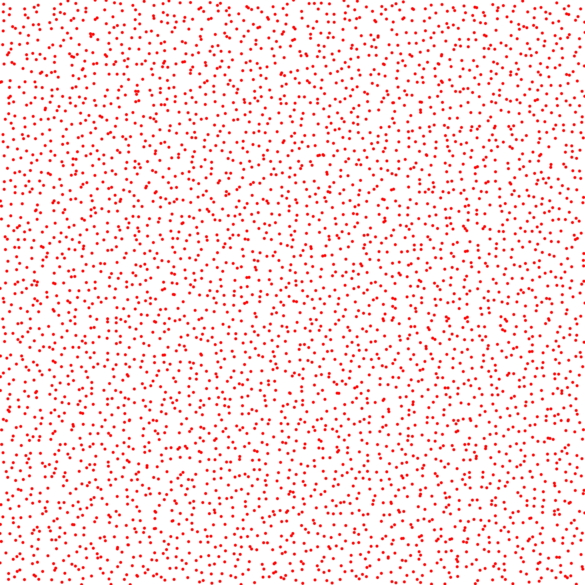
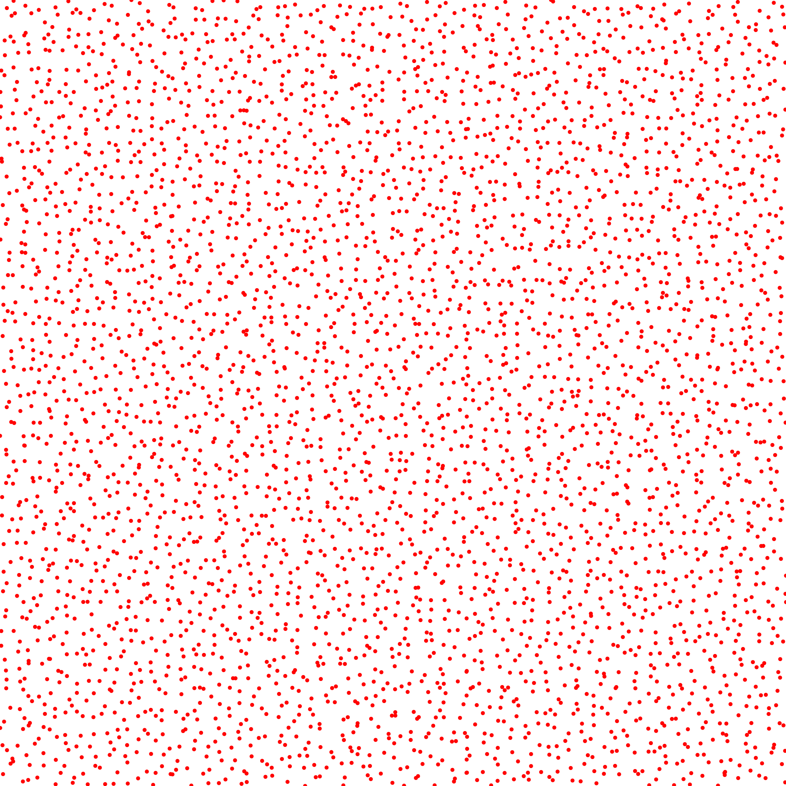
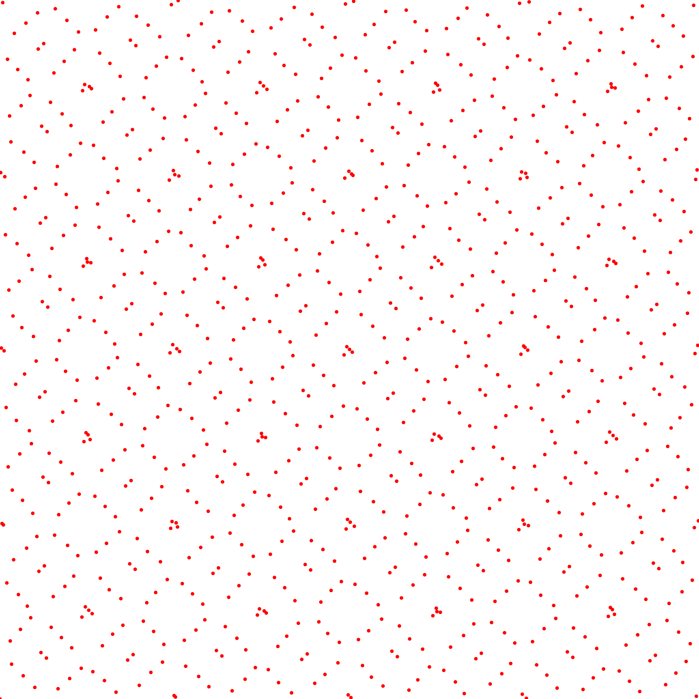
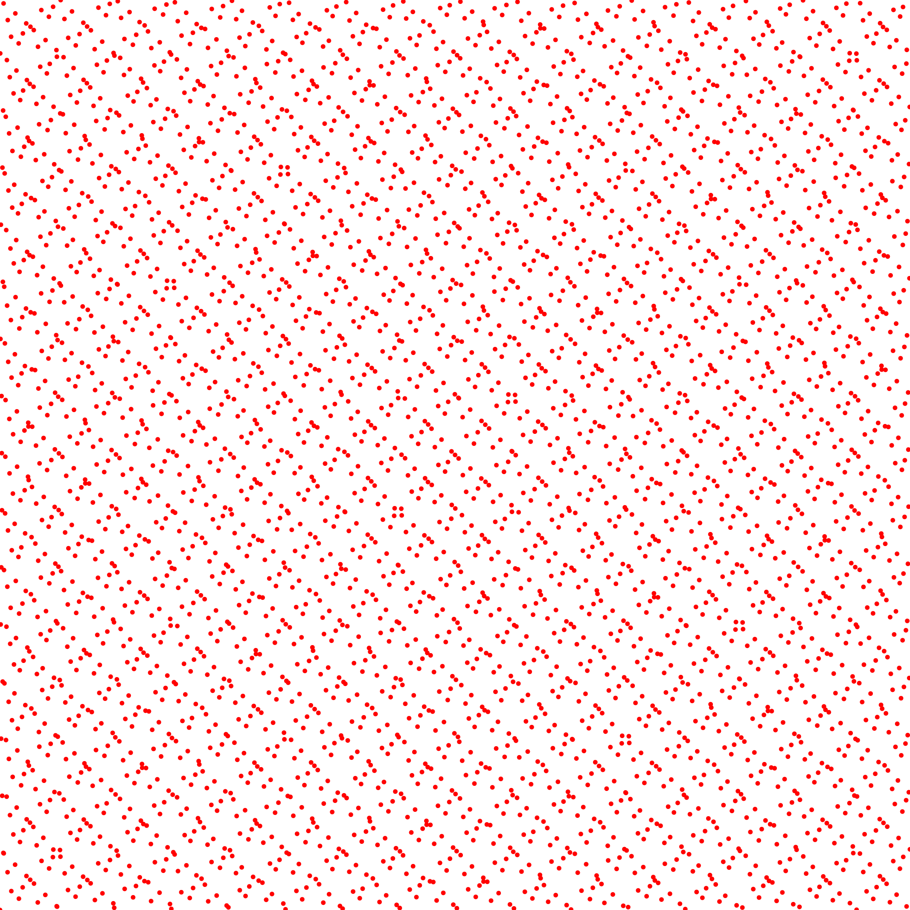

# Unanchored L2 Discrepancy

## Files

      src/discrepancy/UnanchoredL2Discrepancy.hpp
			src/bin/discrepancy/UnanchoredL2Discrepancy_2dd.cpp.


## Description

This tool computes the Unanchored L2 discrepancy of an input pointset using the following formula  
[](data/unanchored_l2_disc/unanchored_disc.png)  
from [[Lem09]](http://www.springer.com/us/book/9780387781648).

## License

BSD, see `UnanchoredL2Discrepancy.hpp`.

## Execution


Parameters:  

```
	[HELP]
	-h [string]		Displays this help message
	-i [string]		The input pointsets
	-o [string]		The output discrepancies
	-s [uint]		The number of samples to read (if computing from a sequence)
	--silent 		Silent mode
	--brute 		Output brute values instead of computing the statistics
```			

To evaluate the discrepancy of an input 2D point set, one can use the following client line command:

     ./bin/discrepancy/UnanchoredL2Discrepancy_fromfile_2dd -i toto.dat

Or one can use the following C++ code:

``` cpp    
    UnanchoredL2Discrepancy.hpp discrepancy_test;
    DiscrepancyStatistics stats;
    Pointset< D, double, Point > pts;
    //We assume pts is filled
    stats.nbpts = pts.size();

    //Can be done several times if we need to average over
    //several stochastic pointsets
    double discrepancy = 0;
    discrepancy_test.compute< D, double, Point >(pts, discrepancy)
    stats.addValue(discrepancy);

    stats.computeStatistics();
    std::cout << stats << std::endl;    			
```

## Results

Stochastic sampler

```
./bin/discrepancy/UnanchoredL2Discrepancy_fromfile_2dd -i stratified_256.dat
#Nbpts		#Mean		#Var		#Min		#Max		#NbPtsets
256		0.00352541		3.02457e-08		0.00317938		0.00378527		10
```

[](data/unanchored_l2_disc/stratified_256_1.png) [](data/unanchored_l2_disc/stratified_256_2.png) [](data/unanchored_l2_disc/stratified_256_3.png) ...

```
./bin/discrepancy/UnanchoredL2Discrepancy_fromfile_2dd -i stratified_1024.dat
#Nbpts		#Mean		#Var		#Min		#Max		#NbPtsets
1024		0.00126314		9.53465e-10		0.0012084		0.00130749		10
```

[](data/unanchored_l2_disc/stratified_1024_1.png) [](data/unanchored_l2_disc/stratified_1024_2.png) [](data/unanchored_l2_disc/stratified_1024_3.png) ...

```
./bin/discrepancy/UnanchoredL2Discrepancy_fromfile_2dd -i stratified_4096.dat
#Nbpts		#Mean		#Var		#Min		#Max		#NbPtsets
4096		0.00046235		1.53657e-10		0.000438963		0.000485913		10
```

[](data/unanchored_l2_disc/stratified_4096_1.png) [](data/unanchored_l2_disc/stratified_4096_2.png) [](data/unanchored_l2_disc/stratified_4096_3.png) ...

Deterministic sampler

```
./bin/discrepancy/UnanchoredL2Discrepancy_fromfile_2dd -i sobol_1024.dat
#Nbpts		#Mean		#Var		#Min		#Max		#NbPtsets
1024		0.000553279		0		0.000553279		0.000553279		1
```

[](data/unanchored_l2_disc/sobol_1024.png)

```
./bin/discrepancy/UnanchoredL2Discrepancy_fromfile_2dd -i sobol_4096.dat
#Nbpts		#Mean		#Var		#Min		#Max		#NbPtsets
4096		0.000160965		0		0.000160965		0.000160965		1
```

[](data/unanchored_l2_disc/sobol_4096.png)
