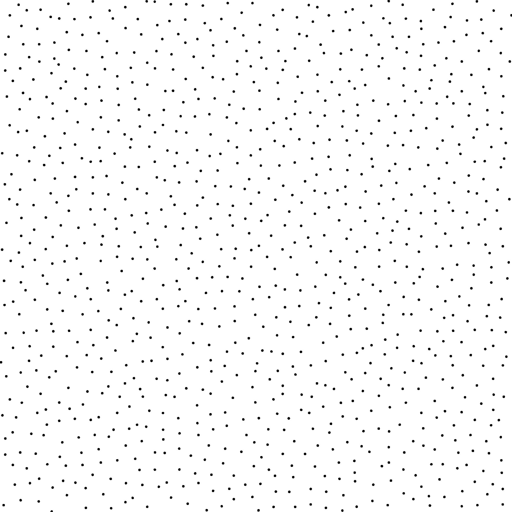
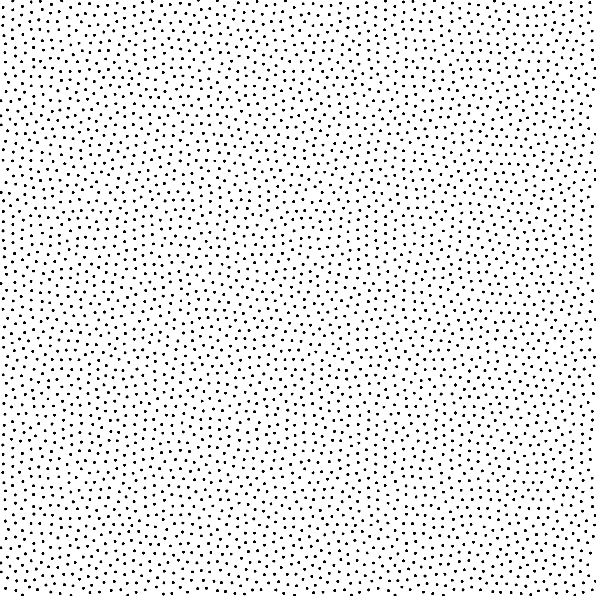
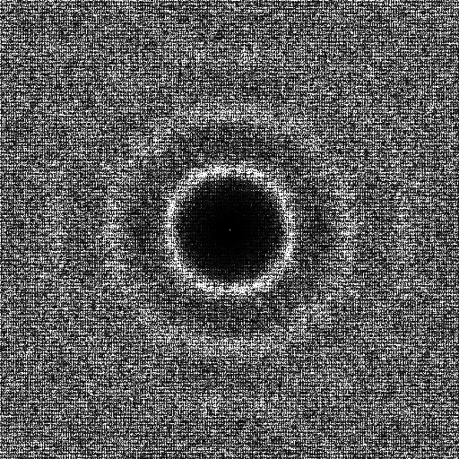

# Sampler ART [[ANH*17]](http://abdallagafar.com/publications/art/)

## Files

    src/samplers/SamplerART.hpp  
    src/bin/samplers/ART_2dd.cpp.cpp

## Description

The sampler from [[ANH*17]](http://abdallagafar.com/publications/art/)  
For a more precise description of this sampler and its performances in terms of aliasing and discrepancy, please refer to the following web bundle [https://liris.cnrs.fr/ldbn/HTML_bundle/index.html](https://liris.cnrs.fr/ldbn/HTML_bundle/index.html).

## License

See author's page.

## Execution

Parameters:  

	[HELP]
	-o [string=output_pts.dat]	Output file
	-m [int=1]			Number of poinset realisations
	-n [ullint=1024]		Number of samples to generate
	--silent 			Silent mode
	-h 				Displays this help message
	-d File containing the tiles offsets

To generate a 2D point set of 1024 samples with a art distribution, we can use the following client line command:

     ./bin/samplers/ART_2dd -d ../../data/ART/table.dat -n 1024 -o toto.dat

Or one can use the following C++ code:

    PointsetWriter< 2, double, Point<2, double> > writer;
    writer.open("toto.dat");
    Pointset< 2, double, Point<2, double> > pts;
    SamplerART s;
    unsigned int param_nbsamples = 1024;
    s.generateSamples< 2, double, Point<2, double> >(pts, param_nbsamples);
    writer.writePointset(pts);
    writer.close();

Results
=======

     ./bin/samplers/ART_2dd -d ../../data/ART/table.dat -o art_1024.edat -n 1024

File  
[art_1024.edat](data/art/art_1024.edat)

Pointset  

Fourier  

     ./bin/samplers/ART_2dd -d ../../data/ART/table.dat -o art_4096.edat -n 4096

File  
[art_4096.edat](data/art/art_4096.edat)

Pointset  

Fourier  

