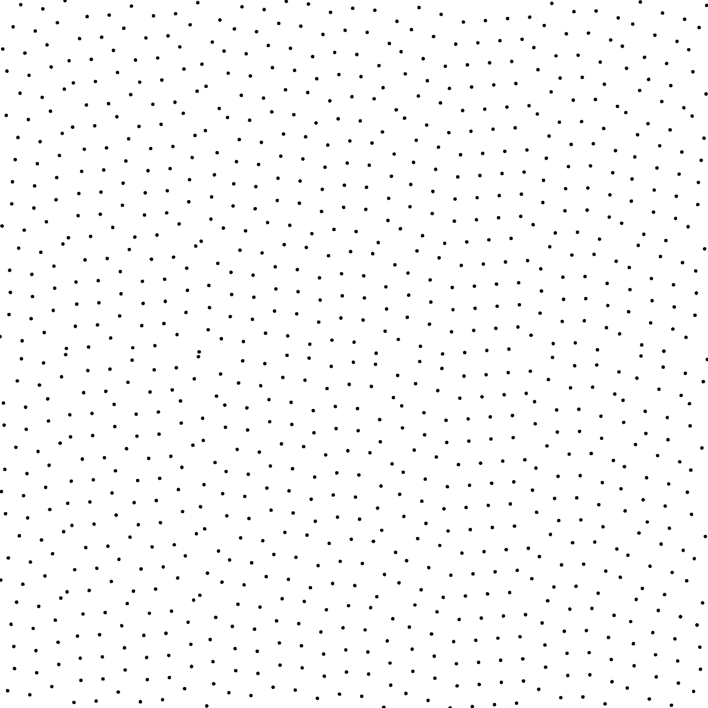
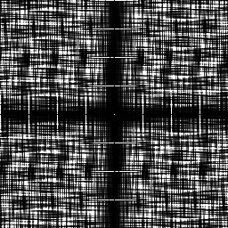
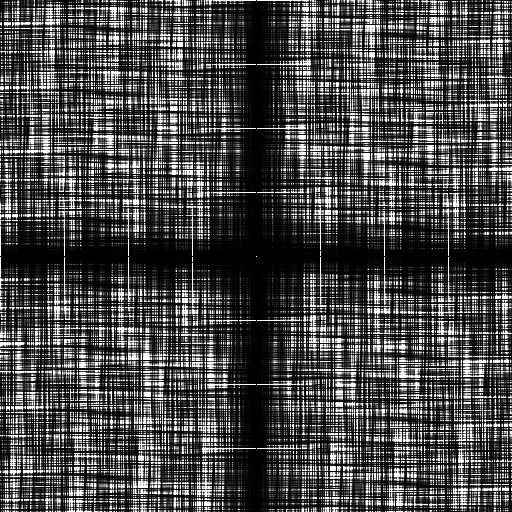

# Sampler Correlated Multi Jittered [[Ken03]](http://graphics.pixar.com/library/MultiJitteredSampling/paper.pdf)


## Files

```
src/samplers/SamplerCMJ.hpp  
src/bin/samplers/CMJ_2dd.cpp
```

## Description


The Correlated Multi-Jitter sampler from [[Kens03]](http://graphics.pixar.com/library/MultiJitteredSampling/paper.pdf).  
For a more precise description of this sampler and its performances in terms of aliasing and discrepancy, please refer to the following web bundle [https://liris.cnrs.fr/ldbn/HTML_bundle/index.html](https://liris.cnrs.fr/ldbn/HTML_bundle/index.html).

## License

BSD,  see `SamplerCMJ.hpp`

## Execution


Parameters:  

	[HELP]
	-o [string=output_pts.dat]	Output file
	-m [int=1]			Number of poinset realisations
	-n [ullint=1024]		Number of samples to generate
	--silent 			Silent mode
	-h 				Displays this help message


To generate a 2D point set of 1024 samples with a cmj distribution, we can use the following client line command:

     ./bin/samplers/CMJ_2dd -n 1024 -o toto.dat

Or one can use the following C++ code:


    PointsetWriter< 2, double, Point<2, double> > writer;
    writer.open("toto.dat");
    Pointset< 2, double, Point<2, double> > pts;
    SamplerCMJ s;
    unsigned int param_nbsamples = 1024;
    s.generateSamples< 2, double, Point<2, double> >(pts, param_nbsamples);
    writer.writePointset(pts);
    writer.close();


Results
=======

     ./bin/samplers/CMJ_2dd -o cmj_1024.edat -n 1024

File  
[cmj_1024.edat](data/cmj/cmj_1024.edat)

Pointset  
[](data/cmj/cmj_1024.png)

Fourier  
[](data/cmj/cmj_1024_fourier.png)

     ./bin/samplers/CMJ_2dd -o cmj_4096.edat -n 4096

File  
[cmj_4096.edat](data/cmj/cmj_4096.edat)

Pointset  
[](data/cmj/cmj_4096.png)

Fourier  
[](data/cmj/cmj_4096_fourier.png)
