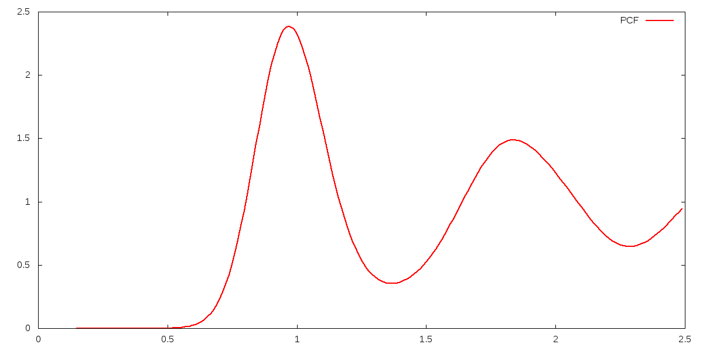
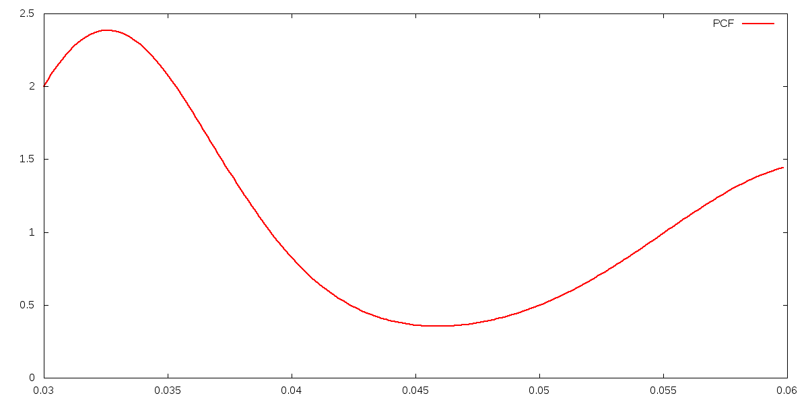
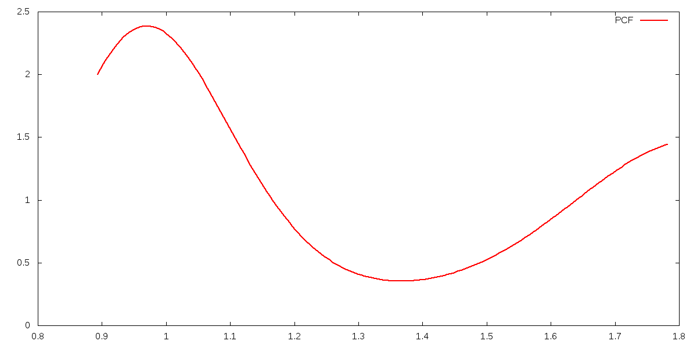
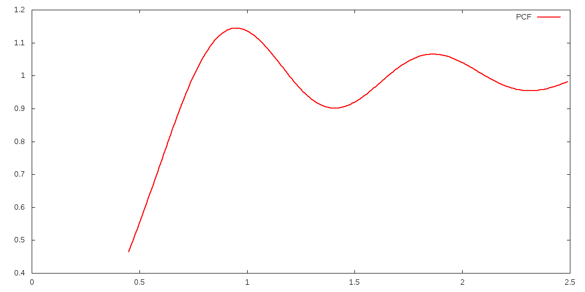

# Point Correlation Function

## Files

    src/bin/statistics/computePCF_2dd.cpp  
    src/statistics/PCF.hpp

## Description

The Pair Correlation Function expresses the distribution of distances between pairs of points in a point set. Intuitively, it expresses the number of samples that are at a distance r from a "typical" sample. [Oztireli](https://graphics.ethz.ch/publications/papers/paperOzt12b.php) devised a simplified estimator for this measure in the particular case of isotropic and stationary point processes. It's this function that is implemented here.

## Execution

```
Parameters:  

	[HELP]
	--silent 	Silent mode
	-h		Displays this help message
	-i the input pointset
	-o the output PCF
	--rmin the minimum radius
	--rmax the maximal radius
	--sigma the sigma of the gaussian used for smoothing
	--nbbins the number of histogram bins
	--unnorm-dist 	does not normalize the distances in the PCF
```

When computing a PCF on a normalized pointset, the normalization is done dividing the distances by R, R being the maximal packing density of 2D spheres ([http://mathworld.wolfram.com/HyperspherePacking.html](http://mathworld.wolfram.com/HyperspherePacking.html)). If normalization is active, rmin and rmax are normalized too, this means that **the values given as parameters for rmin and rmax are not considered normalized**.

To compute the PCF of a 2D pointset, we can use the following client line command:

     ./bin/statistics/computePCF_2dd -i toto.dat -o pcf.dat

Or the following C++ code:

``` cpp
    PCF pcf_engine;
    Pointset< 2, double, Point<2, double> > pts; //we assume pts is filled
    Histogram1dd pcf_data;

    bool normalize = true;
    double R = 2.0 * sqrt( 1.0 / (2.0*sqrt(3.0)*pts.size()) );
    double smoothing = 0.1*d;
    //To start as close as possible from 0 without introducing smoothing artefacts
    double rmin = 1.5*smoothing;
    //Default value assume normalization as we do not know the unnormalized distances between samples
    double rmax = 2.5*d;
    pcf_engine.compute< 2, double, Point<2, double> >(pts, pcf_data, rmin, rmax, nbbins, smoothing, normalize);
```    			

Note that this code only works for 2D point sets.

## Results


From the following pointset  
[bnot_1024.dat](data/pcf/bnot_1024.dat)

-> Normalized and Unnormalized Data

     ./bin/statistics/computePCF_2dd -i bnot_1024.dat -o pcf.dat

  

     ./bin/statistics/computePCF_2dd -i bnot_1024.dat -o pcf.dat --unnorm-dist

  

-> Changing the rmin, rmax parameters

     ./bin/statistics/computePCF_2dd -i bnot_1024.dat -o pcf.dat --rmin 0.03 --rmax 0.06 --unnorm-dist

  

     ./bin/statistics/computePCF_2dd -i bnot_1024.dat -o pcf.dat --rmin 0.03 --rmax 0.06

  

-> Changing smoothness, note that as sigma changes, so does the Y axis

     ./bin/statistics/computePCF_2dd -i bnot_1024.dat -o pcf.dat --sigma 0.001

  

     ./bin/statistics/computePCF_2dd -i bnot_1024.dat -o pcf.dat --sigma 0.3


